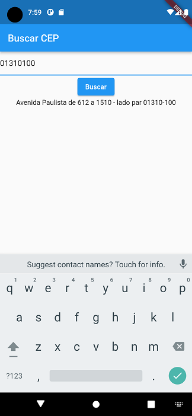

<h1 align="center">
    
</h1>

Um buscador de CEP nunca visto antes!

<h6 align="center"> 🚧 Em construção... 🚧 </h6>

    

---

### Sobre o projeto

Busca Cep - é um buscador de endereço que através do CEP digitado, retorna o endereço completo. Foi desenvolvido em Flutter.

---

### Layout

---

### Tecnologias

As seguintes ferramentas foram usadas na construção do projeto:

- [Flutter](https://flutter.dev/)
- [Dart](https://dart.dev/)
- [Dio](https://pub.dev/packages/dio)
  
---

### Licença

Este projeto esta sobe a licença MIT.

---

Feito com ❤️ por Bruno Mota 👋🏽 [Entre em contato!](https://www.linkedin.com/in/bmotadev/)
